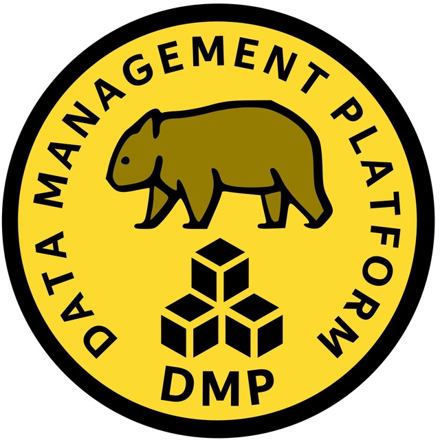

Платформа управления данными Yandex Go
======================================

Доклады с конференций
---------------------

- SmartData 2023 - [Платформа управления данными вокруг YTsaurus](https://smartdataconf.ru/talks/a9ac6358d6b6435ab0e0c13d64c01721/)
- Highload++ Serbia 2023 - [Data Management Platform over YTsaurus: The Path from User to Contributor](https://highload.rs/2023/abstracts/9797)
- Saint Highload++ Осень 2021 - [ETL-сервисы и таски для Такси, Еды и Лавки](https://highload.ru/spb/2021/abstracts/7262). Как мы разрабатываем платформу управления данными.
- HighLoad++ Весна 2021 - [Как подключить к Apache Spark проприетарный источник данных](https://highload.ru/spring/2021/abstracts/7266): теория, практика, грабли, костыли
- SmartData 2021 - [Greenplum и Anchor modeling](https://smartdataconf.ru/talks/SwBciRvIntoJlaX31hzNb/): Как мечты разбиваются о реальность
- SmartData 2020 - [Как мы разрабатываем DMP для Такси, Еды и Лавки](https://smartdataconf.ru/talks/3fNm49aTNBkyKNqemzbTMC/)
- SmartData 2020 - [Highly Normalized Hybrid Model](https://smartdataconf.ru/talks/1O78KCRupy6QCaAff4M5oh), Или как мы внедрили свою модель хранения данных
